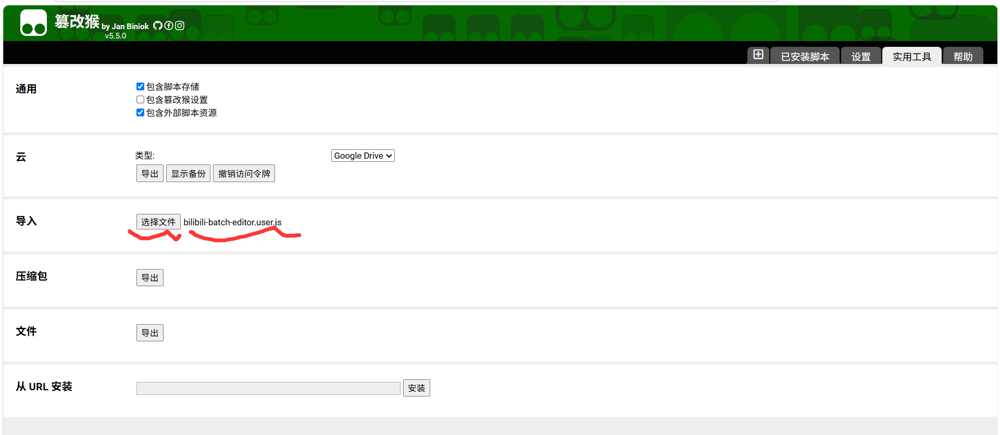
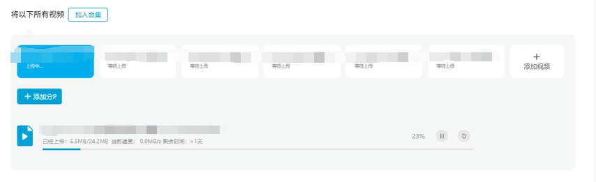
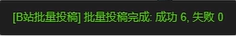

# B站批量投稿设置助手

## 课程不想看？舍不得删？储存又不够，云盘还没空间？云盘预览视频慢的要死？直接用b站看不就好了！
## 还自带倍速和ai字幕，点开b站就可以看，岂不美哉？

于是就有了这一个在 B 站批量上传仅自己可见稿件的页面注入浮动面板，把b站当云盘用的辅助脚本。
可以批量把哔哩哔哩的待上传稿件全部变成仅自己可见，直接把b站当云盘存。
bilibili的封面，标签，声明等必须选项会自动批量填写。

## 安装

1. Edge 浏览器安装 [Tampermonkey](https://microsoftedge.microsoft.com/addons/detail/tampermonkey/iikmkjmpaadaobahmlepeloendndfphd) 或 [Violentmonkey](https://microsoftedge.microsoft.com/addons/detail/violentmonkey/eeagobfjdenkkddmbclomhiblgggliao)

2. 打开扩展管理页面 → 新建脚本 → 导入或者粘贴 `bilibili-batch-editor.user.js` 的全部内容 → 保存，如图


## 功能

| 按钮 | 说明 |
|------|------|
| **选择封面图片** | 选一张本地图片，预览后待用 |
| **一键全部设置** | 对**所有**待上传视频依次执行：创作声明、隐私、分区、标签、封面 |
| **仅声明** | 批量设创作声明 →「内容无需标注」 |
| **仅隐私** | 批量设可见范围 →「仅自己可见」 |
| **仅标签** | 批量为每个视频添加推荐标签 |
| **批量立即投稿** | 逐一点击「立即投稿」发布所有视频（独立功能，含确认弹窗） |

ps：对你已经上传的视频无效，只能操作这里的待上传视频



## 使用流程

1. 打开批量上传页面，上传好视频文件后，右下角出现控制面板
2. 点击「选择封面图片」选图 → 预览确认
3. 点「一键全部设置」→ 脚本自动依次选中每个视频、填写表单
4. 检查设置无误后，点「批量立即投稿」完成发布

> 处理期间**不要移动鼠标**，保持页面在前台。
运行时会显示如下：


运行完成：

## 配置

修改文件顶部 `CONFIG` 对象调整行为：

```js
const CONFIG = {
  DECLARATION_TEXT: '内容无需标注',  // 创作声明默认选项
  PRIVACY_TEXT: '仅自己可见',        // 可见范围默认选项
  DELAY_BETWEEN_TASKS: 2500,        // 每个视频之间的等待时间 (ms)
  DELAY_AFTER_CLICK: 800,           // 点击选中后等待表单加载的时间 (ms)
};
```

## 调试

面板底部有「操作日志」折叠区，展开可查看每一步的执行详情。F12 Console 中也能看到脚本输出的日志。

## 许可

禁止商业，自用的话随意。二改了记得喊我一声，让我瞅瞅你的（嘻嘻）

## 原作者的碎碎念
tasks.length检测有点小bug，修了一下。刚进去看到检测到0任务是正常的，直接点一键全部设置就行。

其他功能基本上没问题了，不过批量投稿视频似乎不是按照顺序投的。不过由于按顺序投也会因为审核时间差导致顺序出错，所以我就没修。

分区我默认选的绘画（因为我写这个脚本的目的是存绘画教程），找不到这个分区就会用一个默认分区。
